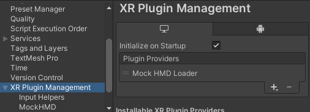
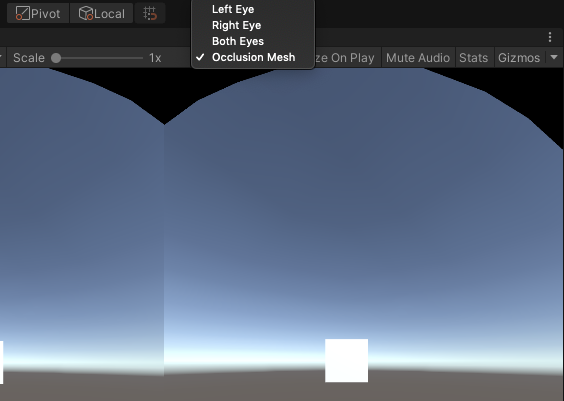
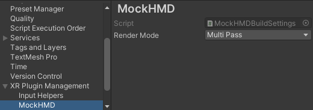

# About the Mock HMD XR Plugin

The Mock HMD XR Plugin enables you to build VR applications without a device.

It provides stereo rendering support by mimicking the display properties of an HTC Vive HMD.

## XR plugin systems

### Display

Display supports all graphics APIs for basic stereo rendering support.

### Input

Input is not supported. It's up to your application to mock input by moving the camera's parent, or providing its own Tracked Pose Driver source.

## Getting started

Add the Mock HMD Loader to XR Management.

Enter Play mode. Select the Game view render mode from the drop-down above the Game view.

## Game view blit modes

* **Left Eye** - Just the left eye, cropped to the center of the image.
* **Right Eye** - Just the right eye, cropped to the center of the image.
* **Both Eyes** - Both eyes, cropped and displayed side-by-side.
* **Occlusion Mesh** - Full left and right eyes, shown side-by-side as they would be submitted to the compositor. Uses Vive's occlusion mesh.

Use the API [XRSettings.gameViewRenderMode](https://docs.unity3d.com/ScriptReference/XR.XRSettings-gameViewRenderMode.html) to control the blit mode at runtime for the built-in renderer. Scriptable Render Pipelines control the blit mode themselves.

## Stereo render modes

The mock HMD supports the following stereo rendering modes:

* **MultiPass** - Submit separate draw calls for each eye.
* **SinglePassInstanced** - Submit one draw call for both eyes.

You can set the render mode at build time in the **Project Settings** window (from Unity's main menu, go to. **Edit &gt; Project Settings**, then select the **XR Plugin Management &gt; MockHMD** category from the menu on the left.  The setting will take effect in play mode.

You can also set the render mode at runtime using `MockHMD.SetRenderMode`. Be sure to reference the `Unity.XR.MockHMD` asmdef + namespace.
